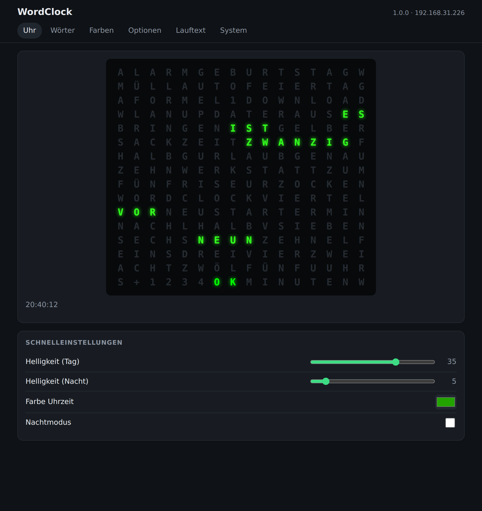
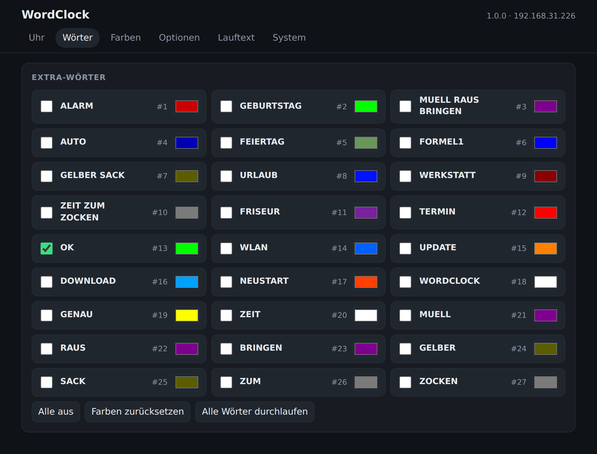
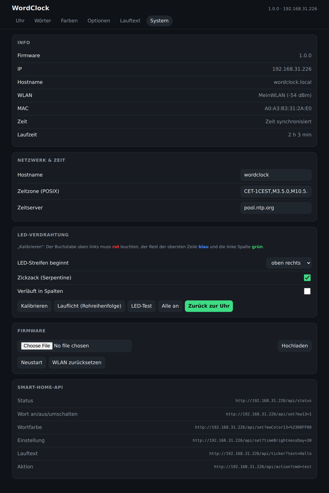
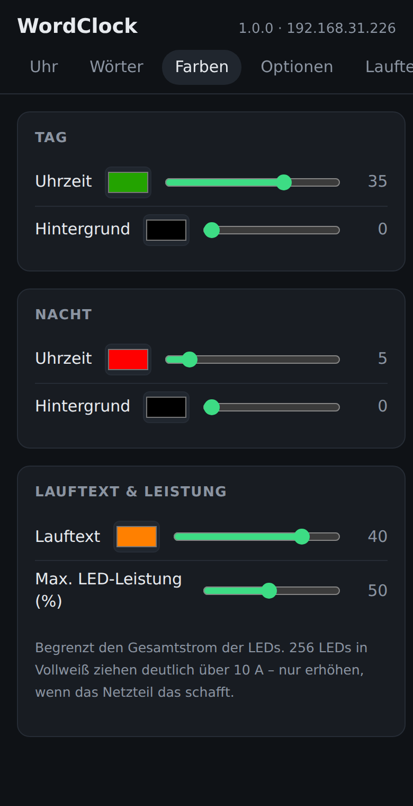

# WordClock 16x16 – Firmware & Home Assistant Integration

Eigene Firmware für die WordClock 16x16 (ESP32, 256 WS2812B-LEDs) plus passende
Home-Assistant-Integration. Alles läuft lokal, ohne Cloud.



## Inhalt

| Ordner | Inhalt |
| --- | --- |
| `ESP32/` | Quellcode der Firmware (PlatformIO) und fertige `WordClock-full.bin` |
| `custom_components/awsw_wordclock/` | Home-Assistant-Integration (Installation über HACS) |
| `3D/` | Sicherung der 3D-Druckdateien von AWSW (CC BY-NC 4.0) |
| `docs/images/` | Screenshots |

Die kompilierte Firmware hängt außerdem an jedem [Release](../../releases).

## Funktionen

- Deutsche Uhrzeit in Worten, optional mit Einzelminuten (`+ 1 2 3 4 MINUTEN`)
- **27 Extra-Wörter** einzeln schaltbar, jedes mit eigener Farbe (ALARM, GEBURTSTAG, MÜLL RAUS BRINGEN, OK, WLAN, …)
- Farben und Helligkeit getrennt für Tag, Nacht und Hintergrund, Nachtmodus mit Uhrzeiten
- Sanfte Übergänge, zufällige Tagesfarbe, digitale Uhrzeit zur vollen Stunde, Lauftext
- WLAN-Einrichtung per **WPS**, Fallback auf Hotspot
- Weboberfläche mit Live-Vorschau, Firmware-Update direkt im Browser
- JSON-API, kompatibel zur AWSW-Firmware V5
- Home Assistant: alle Wörter als Lichter, Schalter, Tasten, Sensoren, Lauftext

## Hardware

- NodeMCU ESP32 mit USB-C (ältere D1-mini-ESP32 laufen auch)
- 16×16 WS2812B-Matrix, Datenleitung an **GPIO32**, Start oben rechts im Zickzack
- USB-Netzteil 5 V / 3 A (die Firmware begrenzt die LED-Leistung standardmäßig auf 50 %)

### 3D-Druckdateien

Gehäuse und Frontplatten gibt es auf Printables:
[WordClock 16x16 (2024) von AWSW](https://www.printables.com/model/768062-wordclock-16x16-2024)

Eine Sicherungskopie inkl. Druckhinweisen, Teileliste und Verkabelung liegt in [`3D/`](3D/)
(Lizenz: CC BY-NC 4.0 von AWSW).

## Firmware flashen

Benötigt Python und esptool (`pip install esptool`). Den COM-Port findest du im Geräte-Manager
unter „Anschlüsse (COM & LPT)“. Falls dort nur ein unbekanntes Gerät steht, fehlt der
[CP210x-Treiber](https://www.silabs.com/developer-tools/usb-to-uart-bridge-vcp-drivers).

**1. Backup der alten Firmware** (empfohlen)
```
python -m esptool --port COM4 -b 921600 read_flash 0 0x400000 backup.bin
```

**2. Flashen**
```
python -m esptool --port COM4 -b 921600 write_flash 0x0 WordClock-full.bin
```

Ohne Installation geht es auch im Browser (Chrome/Edge) mit dem
[ESP Web Tool](https://espressif.github.io/esptool-js/): `WordClock-full.bin` an Adresse `0x0`.

**Updates** danach ohne Kabel: Weboberfläche → *System* → *Firmware* → `WordClock-ota.bin` hochladen.

## WLAN einrichten

| Anzeige | Bedeutung |
| --- | --- |
| **WLAN** blinkt orange | WPS aktiv (3 Minuten) – WPS-Taste am Router drücken |
| **WLAN** blinkt rot | WPS erfolglos – mit dem Hotspot `WordClock-Setup` verbinden und Netz auswählen |
| **WLAN** blau | Verbindung wird aufgebaut |
| **OK** grün | Verbunden, danach erscheint die Uhrzeit |

Ohne Einrichtung startet die Uhr nach 5 Minuten neu und versucht es erneut.
*System → WLAN zurücksetzen* löscht das gespeicherte Netz.

Die Weboberfläche ist danach unter <http://wordclock.local> oder der IP-Adresse erreichbar.

## Weboberfläche

| Uhr | Wörter |
| --- | --- |
|  |  |

| System | Farben (Handy) |
| --- | --- |
|  |  |

Leuchten Buchstaben falsch, hilft *System → LED-Verdrahtung → Kalibrieren*: oben links rot,
der Rest der obersten Zeile blau, die linke Spalte grün.

## Extra-Wörter

| Id | Wort | Id | Wort |
| --- | --- | --- | --- |
| 1 | ALARM | 15 | UPDATE |
| 2 | GEBURTSTAG | 16 | DOWNLOAD |
| 3 | MÜLL RAUS BRINGEN | 17 | NEUSTART |
| 4 | AUTO | 18 | WORDCLOCK |
| 5 | FEIERTAG | 19 | GENAU |
| 6 | FORMEL1 | 20 | ZEIT |
| 7 | GELBER SACK | 21 | MÜLL |
| 8 | URLAUB | 22 | RAUS |
| 9 | WERKSTATT | 23 | BRINGEN |
| 10 | ZEIT ZUM ZOCKEN | 24 | GELBER |
| 11 | FRISEUR | 25 | SACK |
| 12 | TERMIN | 26 | ZUM |
| 13 | OK | 27 | ZOCKEN |
| 14 | WLAN | | |

Die Ids 1–12 entsprechen der AWSW-Originalfirmware. Neue Wörter werden in `ESP32/src/layout.h` definiert.

## Home Assistant

### Installation über HACS

1. HACS → *Benutzerdefinierte Repositories* → dieses Repository als **Integration** hinzufügen.
2. „AWSW WordClock“ installieren und Home Assistant neu starten.
3. *Einstellungen → Geräte & Dienste → Integration hinzufügen → AWSW WordClock*,
   dann IP-Adresse oder `wordclock.local` eingeben.

Die Uhr wird über ihre MAC-Adresse erkannt. Ändert sich die IP, reicht *Neu konfigurieren*.
Mit dieser Firmware fragt die Integration die Uhr alle 5 Sekunden ab.

### Entitäten

| Typ | Entitäten |
| --- | --- |
| Licht | Jedes Extra-Wort (an/aus, Farbe, Helligkeit), Zeit, Zeit (Nacht), Hintergrund, Hintergrund (Nacht) |
| Schalter | Nachtmodus, Einzelminuten, „ES IST“ anzeigen, sanfter Übergang, digitale Zeit zur vollen Stunde, zufällige Tagesfarben, Startanimation, IP beim Start anzeigen |
| Taste | Neustart, LED-Test, Digitalzeit-Test, Wortfarben zurücksetzen, alle Extra-Wörter aus, Zeit synchronisieren |
| Sensor | Firmware-Version, Gerätezeit, Tag-/Nacht-Status, aktuelle Helligkeit, WLAN, IP, NTP-Status u. a. |
| Benachrichtigung | Lauftext |

Lauftext senden:

```yaml
action: notify.send_message
target:
  entity_id: notify.wordclock_lauftext
data:
  message: "Essen ist fertig"
```

Die Integration funktioniert auch mit der AWSW-Originalfirmware ab V5. Funktionen, die nur eine
der beiden Firmwares hat, werden automatisch ein- bzw. ausgeblendet.

## HTTP-API

| Endpunkt | Zweck |
| --- | --- |
| `GET /api/status` | Kompletter Status inkl. `extraWords[]` |
| `GET /api/set?key=value&…` | Einstellungen, z. B. `ew13=1` (auch `0` / `toggle`), `ewColor13=%2300FF00`, `timeColor`, `timeBrightnessDay` (0–50), `nightMode`, `dayStart=07:00`, `maxPower` (%) |
| `GET /api/action?cmd=…` | `restart`, `test`, `digitalTimeTest`, `resetExtraWords`, `wordReset`, `calibrate`, `chase`, `wordCycle`, `allOn`, `stop`, `wifiReset` |
| `GET /api/ticker?text=Hallo&color=%23FF8000` | Lauftext |
| `GET /api/time?value=2026-09-27T20:15:00` | Uhrzeit setzen |
| `GET /api/preview` | Aktuelle LED-Farben (256 × Hex) |
| `POST /update` | Firmware-Upload |

## Firmware selbst bauen

```
cd ESP32
pio run            # bauen
pio run -t upload  # per USB flashen
```

## Releases

Version in `custom_components/awsw_wordclock/manifest.json` erhöhen, committen und nach `main` pushen.
Die GitHub Action baut die Firmware mit derselben Versionsnummer, erstellt das Release mit
`WordClock-full.bin` und `WordClock-ota.bin`, und HACS bietet das Update in Home Assistant an.

## Fehlerbehebung

- **Kein COM-Port:** anderes USB-Kabel (reine Ladekabel gehen nicht) oder CP210x-Treiber installieren.
- **Uhr blinkt dauerhaft WLAN:** Router nicht erreichbar oder WPS nicht aktiv – Hotspot `WordClock-Setup` nutzen.
- **Entitäten nicht verfügbar:** IP der Uhr prüfen, ggf. *Neu konfigurieren*.
- **Neue Wörter fehlen in HA:** Integration einmal neu laden.

## Credits

- Hardware-Vorlage: [AWSW WordClock 16x16](https://www.printables.com/model/768062-wordclock-16x16-2024)
- Home-Assistant-Integration basiert auf [HA_AWSW_Wordclock](https://github.com/bluenazgul/HA_AWSW_Wordclock) von [@bluenazgul](https://github.com/bluenazgul)

## Lizenz

Firmware und Integration: MIT – siehe [LICENSE](LICENSE).

Die 3D-Druckdateien in `3D/` sind von AWSW und stehen unter
[CC BY-NC 4.0](https://creativecommons.org/licenses/by-nc/4.0/deed.de) (Namensnennung, nicht kommerziell).
